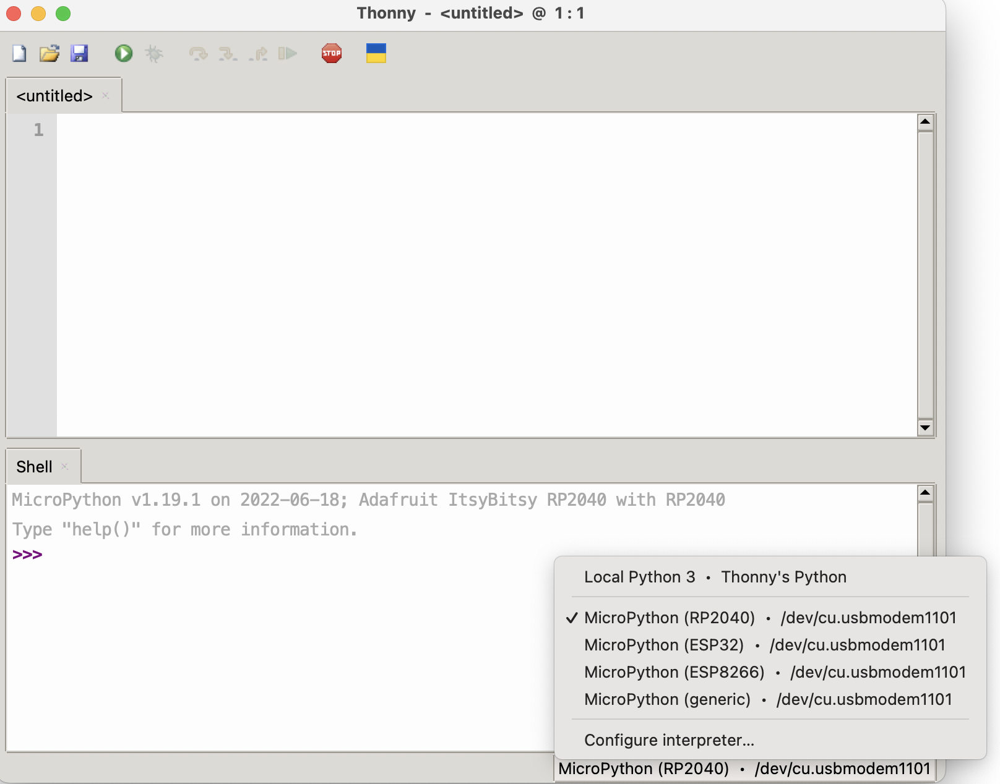

Thonny editor
==============

We suggest using `Thonny editor <https://thonny.org/>`__ for creating and editing
programs for your robot. Please follow the instructions on their website  to install
Thonny  editor on your computer.

Тo verify your installation, connect Yozh to the computer using a USB cable
(using the USB connector of ItsyBitsy board) and
then start Thonny  editor. Select `MicroPython (RP2040)` in the lower right corner
of the screen. Tab `Shell` should show  version of MicroPython installed on the ItsyBitsy
board, similar to what is shown below.

